# casebuddy

A telemetry dashboard for a small HDMI panel mounted inside a PC case. Shows CPU
and GPU temperature with their live clocks, CPU load, memory, VRAM, total system
power, and CPU/GPU fan RPM — at sizes that stay readable on a 4.3" screen seen
through a side panel.

Built for and verified on: Windows 10, Ryzen 7 5700X, RTX 3070, MSI B550M GAMING
PLUS, Python 3.14, an 800x600 4.3" panel fed a 1920x1080 signal on `\\.\DISPLAY2`.

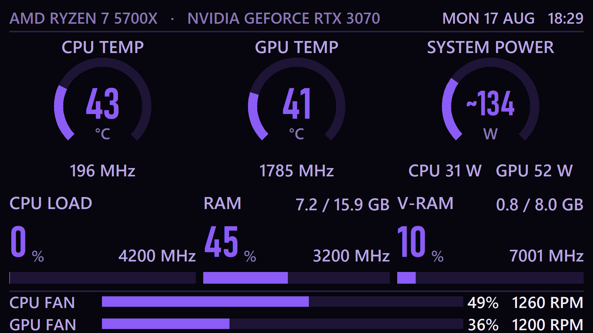

Rendered at 1920x1080, above. Below, the same frame as the 4.3" panel actually
shows it — downscaled to 800x600 with the letterbox bars a 4:3 panel adds:

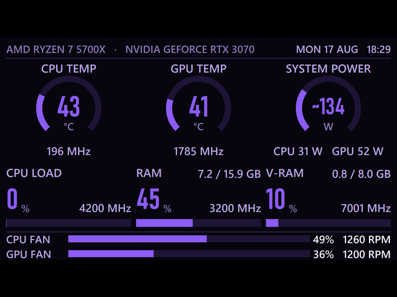

---

## Quick start

```bash
python casebuddy.py --probe
```

That prints one reading of every sensor to the console and exits — the fastest
way to see what your machine exposes. Then:

```bash
python casebuddy.py
```

It picks the smallest non-primary display automatically, goes borderless and
fullscreen there, and hides the cursor. `Esc` or `q` quits.

To run it for real, with no console window: `run.bat`

### One-shot install

Right-click **`setup.bat`** and *Run as administrator*. It installs the one
Python dependency (Pillow), registers CaseBuddy to start at logon, and starts
it. Undo the autostart any time with `schtasks /Delete /F /TN "CaseBuddy"`.

You still need [LibreHardwareMonitor](https://github.com/LibreHardwareMonitor/LibreHardwareMonitor/releases)
running as Administrator with *Options → Remote Web Server* enabled — that is
where CPU temperature, package power and fan speeds come from (see below).

## Screen presets

The **Presets** tab holds thirteen ready-made screens, plus any you save yourself from the Layout tab. Applying one writes exactly
the same `layout` and `theme` the Layout and Theme tabs edit by hand, so the
next thing you do can be to take it apart — a preset is a starting point, not a
mode the app then lives in. Nothing reaches disk until Save & Apply.

| Preset | Screen | What it puts first |
|---|---|---|
| **Classic** | Gauges | The shipped screen: temperatures and system power as rings, load and memory as bars, both fans and the wall-plug watts along the bottom |
| **Thermal** | Gauges | CPU die, GPU core and GPU hot spot as rings; loads drop to bars. Crimson |
| **Gaming** | Gauges | GPU temperature, hot spot and board power; GPU load and V-RAM below. GPU fan takes the first bar. Ice |
| **Power draw** | Gauges | Wall-plug estimate flanked by the two components that are actually measured. Amber |
| **Minimal** | Gauges | Greyscale, fan strip switched off. Six numbers and nothing else |
| **Buddy** | Character | A face that reacts to the machine, wearing your accent colour. Swap it for an emoji or your own picture on the Character tab |
| **Web-slinger** | Character | A hero over a city skyline: hangs while it idles, swings as the load climbs, fights the hottest tile past ninety percent. Spider red on midnight blue |
| **Status face** | Character | The classic corner-of-the-HUD face at panel size: smirks, sweats, bruises, bleeds. Scorched brass and ember |
| **Dragon's Lair** | Character | A serpent in a lava cave: coils and blows smoke rings asleep, circles its hoard under load, breathes fire at the hottest tile past the melting line. Obsidian and ember |
| **Circuit** | Character | A racer lapping the layout itself: drifts every corner, nitro when sweating, smoking donuts around the offender at melting, pit stop when napping. Graphite and signal yellow |
| **Mech** | Character | The robot in the matrix rain: antenna on real network traffic, LED-bar mouth on load, venting past the warn line. Green |
| **Starship** | Character | A ship over the star stream: afterburners lengthen with load, and past 85% it strafes the tile causing the trouble. Nebula indigo |
| **Fish tank** | Character | The persistent pet over an aquarium whose fish swim at fan speed and whose water heats with the silicon. Deep-sea teal |

### Gallery

**Classic**

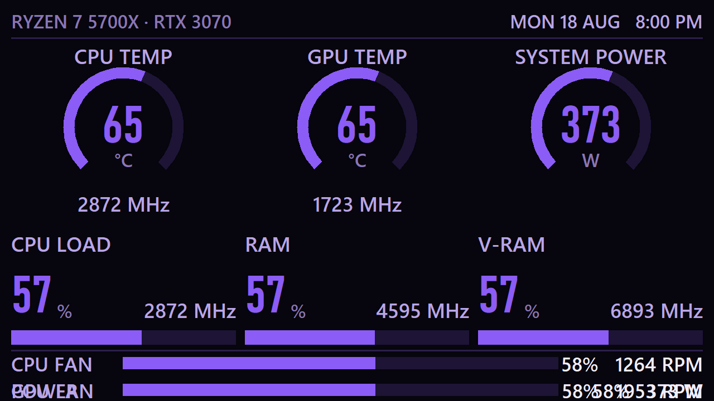

**Thermal**

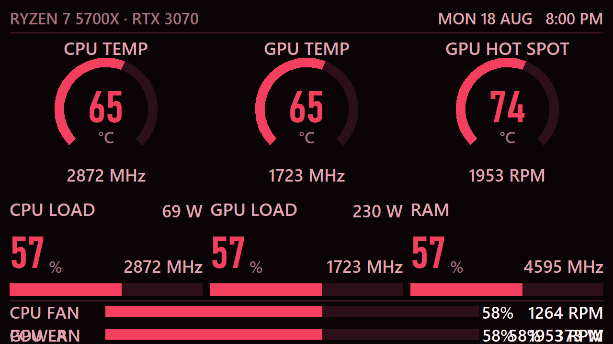

**Gaming**

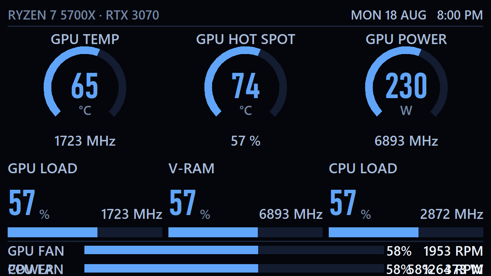

**Power draw**

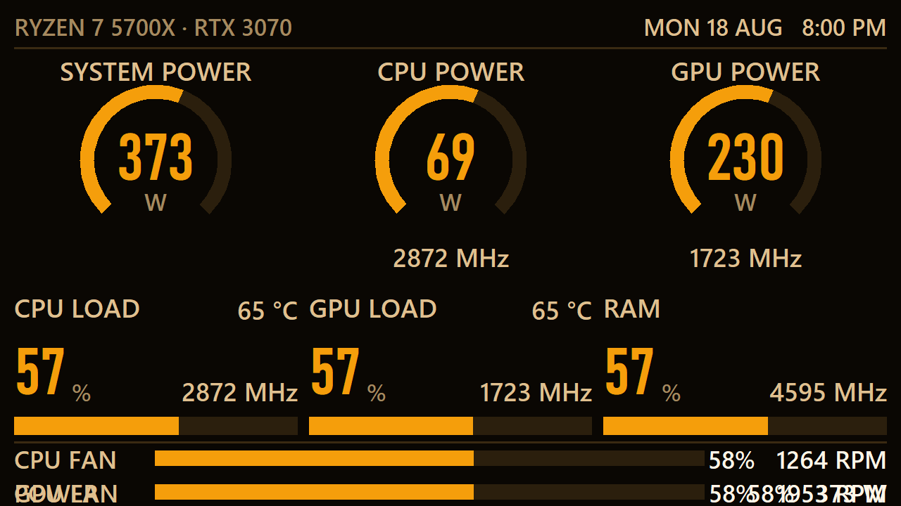

**Minimal**

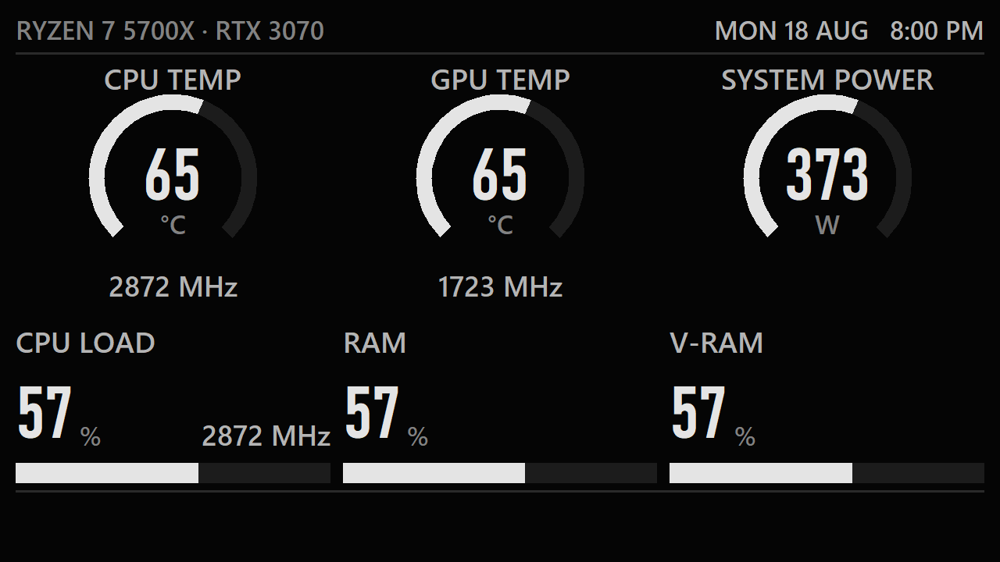

**Buddy**

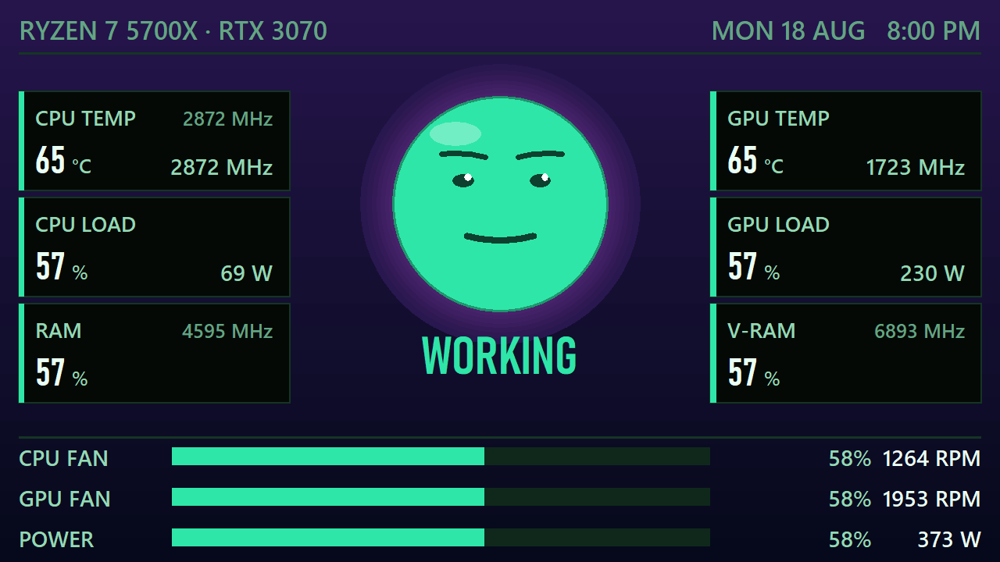

**Web-slinger**

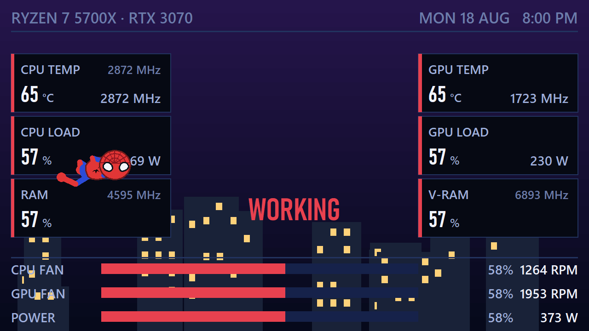

**Status face**

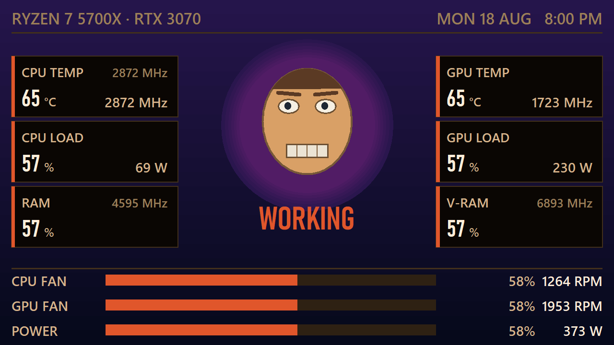

**Mech**

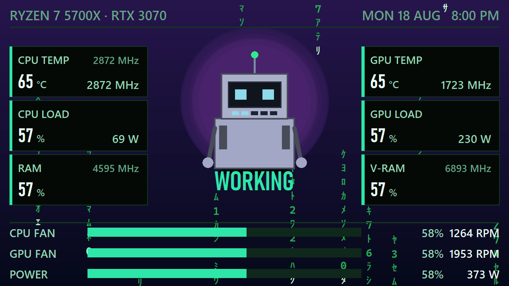

**Dragon's Lair**

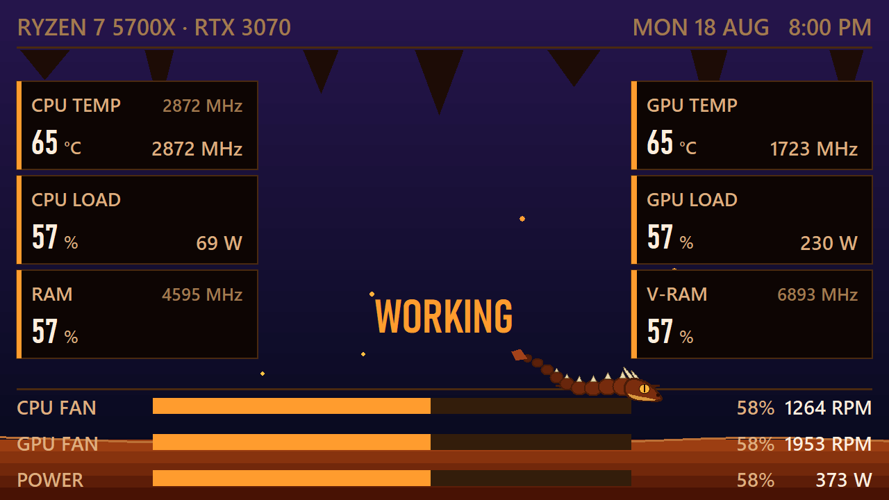

**Circuit**

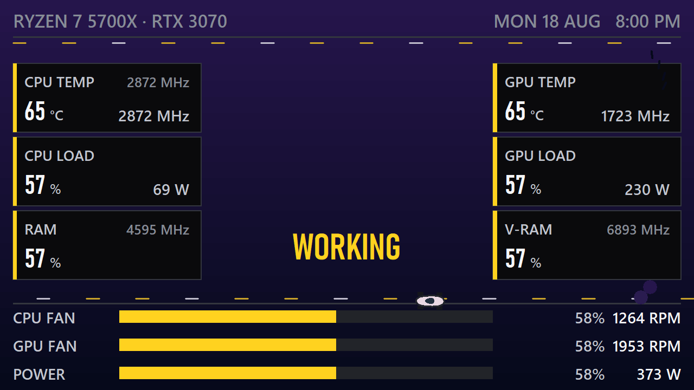

**Starship**

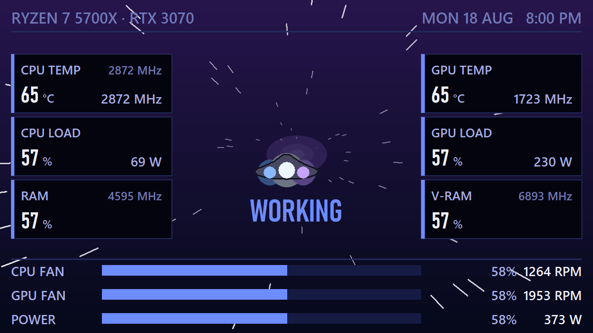

**Fish tank**

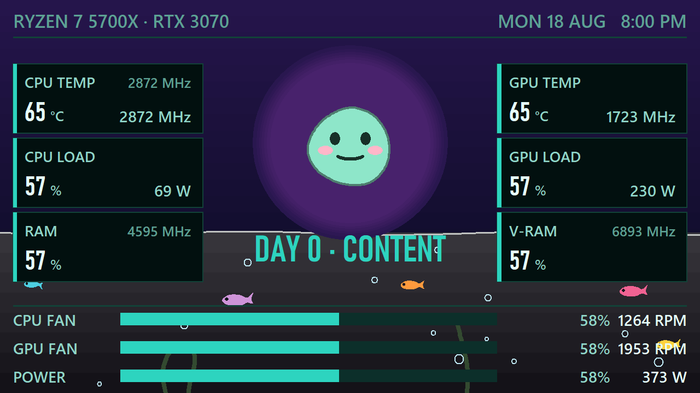

The gallery marks whichever preset your layout still matches. Recolouring one
keeps the mark; repointing a tile at a different sensor drops it, because at
that point the layout is yours rather than the preset's.

Every preset carries a **complete** layout, including the slots its own mode
does not draw — a character preset still ships rings and bars, a gauge preset
still ships stat cards. That way switching mode later always finds sensible
slots waiting instead of an empty screen.

## The buddy screen

A character in the middle of the panel whose mood tracks what the machine is
doing: six stat cards flanking it, the editable header on top, and the fan bars
filling the bottom strip.

### Eleven characters

Three faces and eight animated rigs, all picked on the Character tab:

`character: "drawn"` builds the face from canvas primitives, and its control
points move between moods — the mouth bends, the eyes narrow, the brows tilt —
so it changes continuously rather than cutting between fixed pictures.

`character: "emoji"` puts a **real colour emoji** there instead, one per mood,
every one of them yours to change on the Character tab. That has to go through
Pillow: Tk on Windows draws text with GDI, which has no COLR/CPAL support, so a
glyph handed to the canvas as text arrives as a flat black outline. Pillow
reads those tables directly and Segoe UI Emoji carries vector colour layers, so
the result is sharp at any size rather than an upscaled sprite. Rendering one
costs about 4 ms, so they are cached; a glyph your font lacks (Windows 10 has no
melting face) is detected and the drawn face takes over.

`character: "image"` shows your own picture per mood — an animated GIF plays —
and anything missing falls back to that mood's emoji, then to the drawn face.

The rigs are characters with behaviour, all pure vectors, all reading the same
stress the face does:

| Rig | What it does |
|---|---|
| `doom` | The status face: smirks while idle, then sweats, bruises and bleeds as stress climbs. The eyes glance around on their own |
| `robot` | Wears your accent colour. Antenna blinks with real network traffic, the mouth is a five-LED load bar, and past the warn line its vents vent |
| `cat` | Lives on the stat cards: sleeps curled at idle, patrols the card tops under load, and shoves something off the edge the moment the machine crosses the warn line. Tail wag speed is fan speed |
| `spider` | Chibi-proportioned in the full suit: masked head with its web pattern, big white eyes, blue-and-red two-tone limbs. Hangs upside-down at idle, perches or lounges on a card, swings between web anchors as the load climbs — swing rate from load, width from the real wind outside — and past ninety percent squares up and fights the hottest tile, which visibly takes the hits. Heat spikes get a web to the offending card; NAPPING slings a web hammock between the top cards and he sleeps in it. Restless every 10-20 s, rotating verbs rather than freezing on one |
| `ship` | A starship: holds station at idle, flies patrol as the load rises with afterburners lengthening to match, and past eighty-five percent swings its loop over the offending tile and strafes it — laser bolts, impact flash, the tile knocked sideways. Best over the starfield backdrop, whose stars streak with the same load |
| `dragon` | Serpentine follow-the-leader body that undulates for free. Coil-sleeps with smoke rings, perches and glides, patrols or circles its hoard, blazes with an ember trail or hovers on big wing-beats, breathes a fire cone that rattles the hottest tile, lobs fireballs on heat spikes, shelters dripping from rain, flares at lightning, and its eye glows after dark |
| `car` | Top-down racer whose circuit is the screen edge: parks with exhaust puffs and throttle blips, laps and drifts with tire smoke and racing-line changes, nitro flames and speed lines, donuts around the hottest tile leaving marks, pit stop with jack and Zs on the mood word, headlights after sunset, rain spray, a checkered flag for surviving a melt |
| `pet` | Persistent. Uptime feeds it, it grows over days (a sprout at three, a crown at seven), and cooking the machine today makes it sulk tomorrow. Its memory lives in `pet.json` next to the config |

Everything else — sky, aura, weather, particles, cards, bars — is identical
whichever character is up.

### Backdrops

An animated scene can run behind the character, picked next to it on the
Character tab. Every one is driven by live readings rather than a loop:

| Scene | Driven by |
|---|---|
| `starfield` | Stars streak outward faster as load climbs |
| `synthwave` | The neon grid rolls toward you at load speed |
| `matrix` | Code falls faster under load, stepping one glyph cell at a time |
| `aquarium` | Fish swim at fan speed, bubbles rise with CPU load, and the water itself heats from blue toward red with the hottest sensor |
| `skyline` | A city whose windows light up with load — CPU lights the left half of town, GPU the right — with the real sky and weather above it |

Seasonal effects ride on top: snow drifts through December, and fireworks run
from eight on New Year's Eve through the first. `seasonal: false` turns the
calendar off.

### What the stress meter is computed from

One scalar drives the whole scene, and the meter prints its own inputs so you
never have to take the number on trust:

    STRESS  ▓▓▓▓▓▓▓▓▓▓░░░│░░░░░░   HEAT 66 74°   LOAD 81 88%   66%

`heat` is the hottest of your heat sources, `load` the busiest of your load
sources, both normalised against the **same warn and critical thresholds the
gauge screen uses** — so warn always lands at 0.6 and critical at 1.0 whatever
the units, and amber over there means "sweating" over here. The larger of the
two wins; the tick on the track marks where the loser sits, which is the proof
at a glance that both are being read.

Heat outranks load on purpose. The load term is multiplied by `load_weight`
(0.78 by default) before the comparison, so a CPU pinned at 100% but sitting at
55 °C tops out inside *cooking* — it is working, not suffering — and only real
temperature reaches *melting*. Everything in that paragraph is editable:
`heat_sources`, `load_sources`, `heat_floor`, `load_weight` and the nap timer
all live on the Character tab.

| Mood | Stress | Face | Weather |
|---|---|---|---|
| **NO SIGNAL** | no readings | grey, flat | — |
| **NAPPING** | quiet for 90 s | eyes shut | Zs drifting up |
| **CHILLING** | under 0.42 | sunglasses, alternating with a wide grin | — |
| **WORKING** | under 0.66 | narrowed eyes | sparks orbiting |
| **SWEATING** | under 0.86 | wavy mouth and blush, alternating with panting, tongue out | drops or steam |
| **MELTING** | above 0.86 | spiral eyes | flames round the jaw, and a rescue fan wheeled in per cooking component |

Six moods, and the faces rotate: every 12-24 seconds a mood swaps between its
own look and an alternate (the grin inside CHILLING, the pant inside
SWEATING), so an hour parked in one band never plays a single loop.

Captions, one-liners and emoji are per mood and all editable; leave a field
blank and the built-in stands. Only your departures are written to
`config.json`, so a built-in you never touched can still be improved later.

Mood changes are damped twice: a band edge has to be crossed by a margin before
it counts, and no mood may last less than 2.5 s. Without both, a value resting
exactly on a threshold makes the character strobe. The palette then eases
toward the new mood over about a third of a second instead of snapping, which
is what makes a load spike read as weather rather than as a glitch.

### Why the theme still matters here

The mood owns the colours, which at first left the Theme controls with nothing
to act on — picking a new accent barely changed a character screen at all. So
the mood's accent and glow are blended toward the theme accent by
`theme_blend`, and **that blend fades out as stress rises**. Idle, the screen is
yours; melting, it is red whatever you chose. Card and bar text take their
colours from the theme outright.

### What it costs

Measured on a 5700X at 1280x720, process CPU with the real event loop running:

| Screen | Frame | One core | The machine (16 threads) |
|---|---|---|---|
| Gauges at 2 Hz | 500 ms | 2.7% | 0.17% |
| Buddy at 15 fps | 66 ms | 7.8% | 0.49% |

Nearly all of that is Tk redrawing, not the scene: its own per-frame logic is
1.3 ms against the gauge screen's 0.7 ms. The difference is frame **rate**, not
frame cost, so halving `layout.buddy.fps` roughly halves the bill.

## Everything is editable

The **Layout** tab shows a live, scaled-down copy of the real screen — the
actual renderer on a small canvas, not a mock-up — and every tile on it is
clickable. Hit regions come from the same function that lays the drawing out,
so they cannot drift apart from what is painted.

| | |
|---|---|
| **Screen** | Switch between the gauge and character layouts without touching your palette |
| **Any tile** | Point it at any of ~215 metrics: every live LHM sensor plus the computed ones |
| **Blank** | First in every picker, because emptying a slot is a thing people go looking for |
| **Add / Remove tile** | Up to 3 rings, 3 bars, 3 fan rows, 6 stat cards |
| **Header** | Both halves of the top strip, including the separator |

Metric references are just text, so `config.json` stays diffable. `calc:` refs
are portable across machines; `lhm:/amdcpu/0/temperature/3` points at one
specific sensor on this one, and is the escape hatch for anything the portable
set does not cover.

### Theme packs

The Presets tab can export the whole look — layout, palette, sky overrides,
character, scene, and your face pictures embedded as base64 — into one
`.cbtheme.json` file, and import one back. A pack is exactly the file you hand
to somebody else, so it deliberately never contains your location, weather
provider, API key, or anything else about your machine. Import validates
everything: asset names are flattened so a hostile pack cannot write outside
the `faces` folder, and a malformed file gets a sentence, not a stack trace.

## Automatic preset switching

Two watchers on the Screen tab, both off until you pick a preset for them:

* **While something is fullscreen** — a game, a benchmark, a film on the other
  monitor. The classic use is the Gaming preset appearing exactly when you can
  no longer alt-tab to check the numbers.
* **When nobody is around** — no keyboard or mouse for N minutes, by default
  only after dark (it uses the weather day window, so a machine idling at noon
  keeps its screen).

Fullscreen wins when both hold. Switches are in memory only: `config.json` is
never written, the layout you had comes back the moment the condition clears,
and saving anything from the settings window mid-switch adopts your save as
the new restore point instead of fighting you for the screen. Detection is
three Win32 calls every five seconds, and each verdict must hold for two polls
before anything rebuilds, so alt-tab flicker changes nothing.

## Night dimming

`display.night_dim` (0 to 0.8) fades the whole screen toward black after dark.
It follows the **real daylight figure** rather than the clock, so a panel bolted
inside a case goes quiet when the room does, and it needs a sky source of
`weather` or `clock` to have anything to follow.

The level is quantised to twentieths. Static canvas items take their colour at
build time, so a palette change only reaches them through a rebuild — quantising
costs a handful of rebuilds across a whole dusk instead of one per frame.

## Weather and the daylight cycle

The buddy screen's sky is real. **Open-Meteo** is the default provider because
it needs no account, no API key and no signup, which matters for something that
comes up by itself at boot. OpenWeather works too — pick it on the Weather tab
and paste a key.

Three sources, under **Weather and daylight** on the Data tab:

| `weather.sky` | Does | Network |
|---|---|---|
| `weather` | real conditions and real sunrise/sunset for your location | yes |
| `clock` | daylight only, between two times you set | **none** |
| `off` | no sky data; the mood has the screen to itself | none |

Day and night are not two states but the ends of one continuous blend, so dawn
and dusk happen by themselves: `daylight` walks 0 → 1 across the half hour
around sunrise, and `twilight` is a bump peaking exactly at the horizon
crossing that washes the whole gradient warm as it passes. Both are computed
properties, not stored fields, so they keep moving between the quarter-hourly
refreshes — a reading fifteen minutes old still gives the right sky right now.

Nine conditions each have a day and a night palette: clear, partly cloudy,
cloudy, overcast, fog, drizzle, rain, snow, thunder. With effects on you also
get drifting clouds, rain streaks, snow, stars on a clear night, a sun or moon
tracking its arc, and a brief whitening of the sky during a thunderstorm.

**Every sky is dark.** This panel lives inside a case, and a literal daytime
blue would both light the room and destroy the contrast that every light-on-dark
label here depends on. Weather moves the sky's *hue and texture* rather than its
brightness; day differs from night by a step, not an inversion.

**The mood always wins in the end.** The sky starts as the outdoor one with the
mood mixed over it, weighted by stress — idle, that is mostly weather, but as
the machine heats up the mood takes over and the sky goes amber and then red
whatever the forecast says. `weather.mood_tint` sets the idle balance (0 is pure
weather, 1 is pure mood); stress adds to it.

Weather is also available to **any** layout as ordinary metrics, so you can put
it in a header slot on the gauge screens: `calc:outside_temp`,
`calc:outside_feels`, `calc:weather`, `calc:weather_place` and
`calc:weather_line`.

The outdoor line is a template. Fields: `{place} {temp} {feels} {sky}
{condition} {humidity} {wind} {sunrise} {sunset} {daylight}`, plus `{sep}` for
the separator. A field with no value takes its neighbouring separator with it,
so a reading with no wind does not leave a gap in the middle of the line.

### Location, three ways

| `weather.location` | Does | Requests |
|---|---|---|
| `Mumbai` | Geocoded by name through Open-Meteo, free and keyless | one, at startup |
| `23.03,72.59` | Used directly | **none** |
| `auto` | Looked up from your public IP | one, at startup |

A name that cannot be found falls back to the IP lookup rather than leaving you
with no sky.

### What leaves the machine

In `weather` mode, one lookup request goes out per launch — a geocoding query
for a place name, or an IP-geolocation request for `auto`, which necessarily
reveals your public IP to that service — and then one request per
`refresh_minutes` to the weather provider, carrying a latitude and longitude
rounded to three decimals. Give `location` exact coordinates and the lookup
never happens at all. Use `clock` or `off` and nothing does. It runs on its own daemon thread, never the collector's:
a sensor poll takes about 18 ms and happens twice a second, and a weather
request can hang until its 8-second timeout, so neither may be able to stall the
other. A failed refresh keeps the last good reading rather than blanking the
sky.

## Tray icon and settings

The dashboard uses `overrideredirect(True)`, which keeps it out of the taskbar
and out of Alt-Tab — right for an appliance display, but it also means there is
no way to reach it once running. So there is a notification-area icon (a violet
gauge ring, next to the `^` overflow arrow):

| Menu item | Does |
|---|---|
| **Settings…** | opens the settings window (also the double-click default) |
| **Move to display ▸** | re-places the window; the list is rebuilt each time the menu opens, so a display you just turned on appears |
| **Toggle 4:3 correction** | flips `aspect_fix` without opening anything |
| **Reload config** | re-reads `config.json` from disk |
| **Quit** | stops the collector and exits |

### Themes

Seven presets — `violet` (default), `cyan`, `amber`, `green`, `crimson`, `ice`,
`mono` — on the Theme tab, plus a colour picker for each of the ten palette
slots. A preset sets everything; editing any single colour overrides just that
one, and clearing it inherits from the preset again. Only genuine departures
from the preset are written to `config.json`, so switching preset later
actually changes something instead of being masked by stale overrides.

`warn` and `crit` are deliberately shared across every preset. The whole point
of the scheme is that the panel is one colour until something needs attention,
and a theme that recoloured the alarm states would defeat that.

### Resolution and scale

The Display tab lists every mode the target output offers and marks the native
one, read from the panel's **EDID**, not guessed from the mode list. That
distinction matters: this 1280x720 panel happily advertises 1920x1080, and
driving it there caused desktop-wide stutter and cursor lag until it was set
back. "Largest advertised mode" would have recommended exactly the broken
setting. The tab says plainly whether you are on native.

Resolution is applied as an action rather than stored as a setting — persisting
it would mean the app fighting whatever you or Windows do next. Every change
comes with a **15 second confirm-or-revert** prompt, because a mode the panel
cannot display leaves a black screen with no way to undo it.

`Text scale` (0.6–1.6) multiplies text and stroke weight only, not the layout
grid. Scaling the grid too would just push tiles off a screen the layout was
built to fill exactly; this changes how heavy the content sits inside a fixed
frame. Much above 1.2 and long strings start to collide.

### The settings window

Seven tabs, in the order you would use them. Each is a set of titled groups
rather than a flat wall of rows, and each carries a one-line explanation of
what it is for.

| Tab | Holds |
|---|---|
| **Presets** | The gallery. Pick a whole screen |
| **Layout** | The clickable preview: what each tile shows, adding and removing tiles |
| **Character** | The buddy screen: face, per-mood emoji, captions, one-liners, stress weights |
| **Look** | Palette preset and all ten colours, text scale, night dimming |
| **Data** | Sensor source, weather, thresholds, gauge scales, the power model |
| **Screen** | Monitor, resolution, aspect correction, window behaviour, hotkey |
| **About** | Diagnostics: displays, EDID, sky status, backend reachability |

Edits on the Layout, Character and Look tabs push to the running panel about a
third of a second after you stop typing, without restarting the collector —
poll rates and the endpoint are baked in at construction, and restarting one on
every keystroke would stutter the readings and re-probe the network. Nothing
reaches disk until **Save & Apply**.

### Settings, older notes

Settings is a tabbed window covering all options — display, refresh rates,
sensor transport, fan scales, the power model, and every threshold. It **saves
and applies without a restart**: the collector is rebuilt, the window re-placed
and the canvas redrawn in place.

Two details that matter:

- It writes **only what differs from the defaults**, and preserves your
  `_`-prefixed comment keys. Saving the whole resolved config would freeze
  today's defaults into the file, so a later change to a default you never
  touched would silently never reach you.
- It always opens on the **primary** display. A form rendered on the 4.3" panel
  would be unusable, and the kiosk window is topmost there anyway.

The tray runs its own message pump on a separate thread. Tk is not thread-safe,
so every menu action is handed back to the UI thread through `root.after`.
Calling Tk directly from the tray thread would work most of the time and crash
occasionally, which is the worst kind of bug.

`--no-tray` skips the icon; `--settings` opens the window at startup.

### The tray icon disappears after about a minute

That is Windows, not the app. Windows 10 shows a newly-registered notification
icon briefly and then moves it into the overflow flyout behind the `^` chevron.
Measured with a bare pystray icon, independent of casebuddy:

```
t=10s   pystray.visible=True   icon present in the visible strip
t=45s   pystray.visible=True   gone
t=90s   pystray.visible=True   gone
t=150s  pystray.visible=True   gone
```

The icon stays registered the whole time — Windows simply stops drawing it in
the always-visible area. To pin it: **Taskbar settings → Select which icons
appear on the taskbar → casebuddy → On**, or drag it out of the `^` flyout. That
choice persists.

There is no supported way to do this programmatically on this build. Windows 10
19045 predates the `NotifyIconSettings` registry layout and instead stores tray
promotion in an opaque, obfuscated `IconStreams` blob that requires restarting
Explorer to re-read.

### The hotkey

Because of the above, and because a chrome-free window has no taskbar button and
no Alt-Tab entry, there is a state where the app is running and unreachable. So
there is also a system-wide shortcut — **`Ctrl+Alt+F9`** by default — that opens
settings from anywhere.

Hotkeys are first-come across the whole system, so if the configured combo is
already owned by another app, casebuddy falls back through a short list and logs
which one it actually got, rather than silently ending up with none.
(`ctrl+alt+m` was the original default and turned out to be taken on the
development machine, which is how this was found.)

## Requirements

- Windows 10/11
- Python 3.10+ (`pywin32` optional, only for the RAM speed lookup)
- **LibreHardwareMonitor**, running as Administrator with its web server on

---

## One source

Every live number comes from LibreHardwareMonitor's `/data.json`. That is
deliberate. LHM is already a hard requirement for CPU die temperature, package
power and fan RPM — none of which Windows exposes to unprivileged code — so
reading the GPU and memory from a *second* source only bought the ability to
keep half a dashboard alive while the other half showed dashes. One source
means one failure mode and one sampling instant.

The cost is real and worth stating: if LHM stops, the whole panel goes blank
instead of degrading. Earlier revisions used NVML via `ctypes` for the GPU and
psutil for CPU/RAM, which was faster (0.06 ms versus ~18 ms per poll) and
needed no elevation.

| Metric | LHM sensor |
|---|---|
| CPU temp | `Core (Tctl/Tdie)` |
| CPU clock | max `Core #n (Effective)` |
| CPU load / ceiling | `CPU Total` / `Cores (Average)` |
| CPU watts | `Package` |
| CPU fan | `CPU Fan` (Fan + Control, on the Nuvoton NCT6687D) |
| GPU temp / clock | `GPU Core` |
| GPU watts | `GPU Package` |
| GPU fan | `GPU Fan 1/2` (Fan + Control) |
| RAM | `Memory` load, `Memory Used` / `Memory Available` |
| VRAM | `D3D Dedicated Memory Used` / `GPU Memory Total` |

The one number not from LHM is the RAM speed (3200 MHz). LHM publishes DIMM
capacity and timings but no memory clock, so that comes from
`Win32_PhysicalMemory.ConfiguredClockSpeed` — queried once, since it never
changes.

### Two traps in the sensor list

**VRAM has three different figures and they disagree.** Measured together:

```
/vram/load                  30.1 %   Windows' SHARED budget (9.3 of 21.6 GB)
GPU Memory Used             975 MB   includes ~175 MB driver-reserved
D3D Dedicated Memory Used   807 MB   matches nvidia-smi (801) and Task Manager
```

The D3D figure wins, because Task Manager is the reference anyone can
cross-check against.

**The CPU clock has two figures too.** `Cores (Average Effective)` averages in
parked cores and collapses to ~180 MHz at idle, which reads as a fault. The
dashboard shows the **busiest core's** effective clock instead, with the frozen
`Cores (Average)` ceiling on the CPU LOAD tile for reference.

Nothing else can supply that clock. Both `psutil.cpu_freq()` and the PDH counter
`\Processor Information(_Total)\% Processor Performance` report the nameplate
speed on a Ryzen — measured at **99.0% idle versus 99.1% under a full all-core
load**, i.e. a constant.

---

## Setting up LibreHardwareMonitor

Without it, every CPU tile shows `--`.

A copy lives in `vendor\LibreHardwareMonitor\`, with its config pre-set to run
the web server on port 8085 and start minimised to the tray. Keeping it inside
the app directory matters: a portable zip left in `Downloads` is one cleanup
away from silently breaking the dashboard, and the Scheduled Task stores an
absolute path.

Register it to start elevated at logon, from an **Administrator** PowerShell:

```bash
powershell -ExecutionPolicy Bypass -File tools\install-autostart.ps1 -IncludeLHM
```

That matters because an ordinary "start with Windows" entry cannot elevate, so
it produces a UAC prompt on every boot. The Scheduled Task does not. LHM needs
elevation to load its driver at all.

Confirm with `python casebuddy.py --probe` — `cpu_temp` should read `lhm-http`.

> **Why the config is pre-set rather than ticked in the UI.** LHM writes its
> settings file only on a clean exit. Enabling the web server from its menu and
> then rebooting, or killing the process, loses the setting and every CPU tile
> comes back blank. The bundled config has `runWebServerMenuItem=true` written
> in already, so it survives regardless. Key names were read out of the
> assembly, not guessed.

To upgrade LHM later, unzip the new release over `vendor\LibreHardwareMonitor\`
but keep the existing `LibreHardwareMonitor.config`.

> **Why HTTP and not WMI?** LHM 0.9.6 no longer registers the
> `root\LibreHardwareMonitor` WMI namespace, and looking up a namespace that
> does not exist blocks for ~4 seconds before failing. `transport` therefore
> defaults to `http`. Set it to `auto` or `wmi` only for older builds.

### If CPU fan RPM and motherboard sensors are missing

Fan tachometers live on the board's Nuvoton NCT6687D super-I/O chip. If LHM's
tree shows no *Mainboard* node, the cause is almost certainly this:

**`mainboardMenuItem` is `false` in `LibreHardwareMonitor.config`.** LHM's
Options menu carries a per-hardware-group toggle, and with Mainboard unticked it
never enumerates the super-I/O chip at all — no CPU fan, no board temperatures,
and nothing anywhere saying why. It is off in a default config.

`tools\start-lhm.ps1` now enforces that key (along with the web server and port)
on every launch, after LHM has exited and before it restarts, so the setting
cannot drift. Nothing to do by hand.

Two things that look like the cause but are not, both ruled out by measurement
here: **PawnIO not running yet** (LHM starts it itself, and the Mainboard node
stayed missing with PawnIO already up), and **MSI Center holding the chip** — it
does ship its own ring-0 driver (`NTIOLib_CC_COMM`, from
`MSI Center\Lib\SYS\NTIOLib_X64.sys`, which is how MSI Center reads the CPU fan)
but LHM reads the same chip happily alongside it.

Once the Mainboard node appears you get CPU fan RPM and duty cycle, plus board
temperatures (VRM MOS, PCH, CPU Socket) and the +12V/+5V rails.

---

## The 4:3 problem — do this once

Your panel has 800x600 real pixels (4:3) but is being fed 1920x1080 (16:9).
Its scaler does one of two things, and Windows cannot tell you which:

- **Letterbox** — fitted inside the panel with black bars top and bottom. Both
  axes shrink by 2.4x. Nothing distorts.
- **Stretch** — squeezed onto the whole panel. Horizontal shrinks by 2.4x but
  vertical only by 1.8x, so everything comes out 1.33x too tall.

Run:

```bash
python casebuddy.py --calibrate
```

Is the circle round and the square square?

- **Yes** → leave `aspect_fix` as `"none"`.
- **No, the circle is a tall egg** → press `C`. The shapes should snap to
  correct. Set `"aspect_fix": "squash43"` in `config.json`.

`squash43` draws everything at 75% vertical scale as a centered band, so the
panel's own 1.33x stretch cancels it out. Font sizes shrink by the same 0.75,
landing the text at the right physical height — slightly condensed rather than
slightly stretched, which is the better-looking of the two errors.

---

## Total system power is an estimate

**A desktop PC has no whole-system power sensor.** Verified: no `Win32_Battery`,
no Energy Metering Interface device, and a PSU without telemetry. Reading watts
at the wall needs a smart plug. So casebuddy computes:

```
wall watts = (CPU package W + GPU W + baseline W) / PSU efficiency
```

With LHM running, **both** the CPU and GPU terms are real measurements — the
tile keeps its leading `~` only because `baseline_w` and `psu_efficiency` are
assumptions. If LHM is unavailable the CPU term is interpolated across load
instead and is marked `~` in the breakdown line too.

Defaults assume a B550 board, 2 DIMMs, a couple of drives and 4–5 fans
(`baseline_w: 38`) behind an 80+ Gold supply (`psu_efficiency: 0.90`).

**To make it accurate:** put a wall meter on the PC at idle and adjust
`baseline_w` until casebuddy agrees.

### Why your GPU idles at ~52 W

`DISPLAY1` runs 2560x1440 @144Hz and the panel runs 1920x1080 @60Hz. Mismatched
refresh rates across two outputs pin an NVIDIA card in its top power state — it
reports P0 clocks (1785 MHz core, 7001 MHz memory) at 1% utilization. The case
panel is itself responsible for a good chunk of continuous idle draw. That is
driver behaviour, not this app.

---

## Autostart

```bash
powershell -ExecutionPolicy Bypass -File tools\install-autostart.ps1
```

Registers a Scheduled Task that runs casebuddy at logon after a 25 second delay
(so the GPU driver and the second display are up before the window places
itself). No elevation required for casebuddy itself. Add `-IncludeLHM` from an
Administrator PowerShell to also start LibreHardwareMonitor elevated. Remove
everything with `-Uninstall`.

---

## Command line

| Flag | Effect |
|---|---|
| `--probe` | print one sensor reading and exit |
| `--monitors` | list displays with their positions and exit |
| `--calibrate` | show the aspect-ratio test pattern |
| `--windowed` | 960x540 preview on the primary display |
| `--geometry WxH+X+Y` | exact placement, e.g. `1920x1080+2560+0` |
| `--monitor SEL` | `auto`, `primary`, an index, or `\\.\DISPLAY2` |
| `--squash` | force `aspect_fix=squash43` for this run |
| `--config PATH` | use a different config file |

Keys while running: `Esc`/`q` quit, `C` toggle aspect correction, `F5` rebuild.

---

## Configuration

`config.json` sits next to `casebuddy.py`. Only the keys you set override the
defaults in `casebuddy/config.py`. Keys beginning with `_` are ignored at every
level, so you can leave notes to yourself.

| Key | Default | Meaning |
|---|---|---|
| `display.monitor` | `"auto"` | `auto` = smallest non-primary screen |
| `display.aspect_fix` | `"none"` | `none` or `squash43` |
| `display.date_format` | `"%a %d %b"` | strftime pattern for the header |
| `display.hide_cursor` | `true` | hide the pointer over the window |
| `display.topmost` | `true` | keep above other windows |
| `display.geometry` | `null` | override placement entirely |
| `refresh.ui_hz` | `2.0` | repaints per second |
| `refresh.fast_poll_hz` | `2.0` | NVML + psutil sampling rate |
| `refresh.slow_poll_hz` | `1.0` | LHM sampling rate |
| `gpu.index` | `0` | which GPU |
| `lhm.transport` | `"http"` | `http`, `auto`, `wmi`, `off` |
| `lhm.http_url` | `localhost:8085/data.json` | LHM web server endpoint |
| `fans.cpu_max_rpm` | `2200` | full scale for the CPU fan bar |
| `fans.gpu_max_rpm` | `3400` | full scale for the GPU fan bar |
| `power.baseline_w` | `38.0` | everything that is not CPU or GPU |
| `power.psu_efficiency` | `0.90` | DC→AC conversion loss |
| `power.gauge_max_w` | `450.0` | full scale for the power ring |
| `thresholds.*` | see below | `[warn, critical]` |

Thresholds are `[warn, critical]`; temperatures in °C, the rest in percent
(`power` as a percent of `gauge_max_w`). Below warn is purple, between is amber,
at or above critical is red — the display stays one colour until something
actually needs attention.

---

## How it is put together

```
casebuddy.py              CLI entry point
config.json             your overrides
casebuddy/
  config.py             defaults + deep merge
  metrics.py            Reading / Snapshot — what the UI consumes
  collector.py          background sampling threads
  theme.py              palette, font sizes, the coordinate transform
  dashboard.py          the gauge screen, and the scene factory
  buddy.py              the character screen: mood, face, sky, weather effects
  presets.py            ready-made layout + palette pairs
  catalog.py            every metric a slot can be pointed at
  layout_editor.py      the clickable preview on the Layout tab
  settings_ui.py        the settings window
  window.py             monitor targeting, DPI, the frame loop
  sources/
    lhm.py              LibreHardwareMonitor over HTTP (or WMI) -- everything
    host.py             static facts: CPU model, RAM speed
    weather.py          Open-Meteo / OpenWeather, and the daylight cycle
tools/
  install-autostart.ps1
  start-lhm.ps1         starts PawnIO, waits, then launches LHM
vendor/
  LibreHardwareMonitor/ bundled, with the web server pre-enabled
```

Three threads: Tk's UI thread, one collector, and the weather watcher. Neither
background thread ever touches Tk and the UI never touches a sensor; they meet
at a single snapshot swapped under a lock, so a 2-second HTTP timeout cannot
stall a repaint. Weather gets its own thread rather than a slot in the collector
loop because its request can hang for eight seconds while a sensor poll has to
land twice a second.

`dashboard.make_scene()` picks the renderer from `layout.mode`. Both the gauge
dashboard and the buddy scene take `(canvas, geometry, cfg)` and expose
`build()` / `update(snap)`, so the window and the Layout preview do not care
which one they are holding. A scene may also declare `frame_ms` to ask for a
faster repaint than `ui_hz` — never a slower one.

Canvas items are created once and then only have their text, coordinates and
colors changed. This is not a micro-optimization: deleting and recreating a
120-item scene leaks about **9.7 MB per 1000 frames** on the Tcl side, linearly,
with no plateau — roughly 840 MB/day at 1 Hz. Incremental updates are flat.
Nothing on a periodic path may call `delete()`.

Measured over a 6-minute run, repainting twice a second:

```
CPU   2.4% of one core  =  0.15% of the 16-thread CPU
RSS   74 MB, flat
```

(Those figures were taken before the fan strip replaced the trend graph. The
rendering path is unchanged and the trend history buffers are now gone, so if
anything both numbers should be slightly lower — but they have not been
re-measured since.)

The dashboard is drawn against a fixed 1920x1080 design space; `theme.Geometry`
maps it to the real window. Sizes are set by the panel's physical density —
800x600 across 4.3" is 233 PPI, and the 2.4x downscale means one design pixel is
0.045 mm of glass. Secondary text at 46 px measured 2.1 mm and read as mush, so
the floor is 54 px. Nothing thinner than an 8 px stroke survives the downscale.

---

## Troubleshooting

**CPU tiles stay `--`.** LibreHardwareMonitor is not running, is not elevated,
or its web server is off. `python casebuddy.py --probe` prints which.

**CPU fan shows `--` but everything else works.** No Mainboard node — restart
LHM with PawnIO running, or exit MSI Center first. See above.

**Window opens on the wrong screen.** `python casebuddy.py --monitors` lists what
Windows reports. Do not go by Device Manager or `Win32_VideoController` — it
lists inactive `MS Idd Device` virtual adapters that look like real outputs.

**Everything looks vertically stretched.** Run `--calibrate` and set
`aspect_fix` to `squash43`.

**GPU values vanish after a driver update or a TDR reset.** Expected — NVML
tears down and re-initializes on a 10 second backoff.
